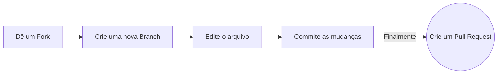

# Hacktoberfest-2022 X NIE GFG Capítulo do Estudante🔥

### Dê uma estrela no repositório :star2:

Dê uma estrela no repositório pressionando o botão superior direito para iniciar sua jornada maravilhosa.


<div align="center">
<a href="https://github.com/niegfg/Hacktoberfest-2022"></a>


<a href="https://github.com/niegfg/Hacktoberfest-2022/tree/main/contributors" ></a>
</div>
<div align="center">
  <spam>Outros Idiomas:<span><br>
  <a href="/languages/pt-br.md">Português Brasileiro</a>
</div>

### Este repositório visa ajudar iniciantes de código com sua primeira solicitação de pull bem-sucedida e contribuição de código aberto. :partying_face:

:star: Sinta-se à vontade para usar este repositório para fazer sua primeira contribuição para um projeto de código aberto no GitHub. Pratique fazer sua primeira solicitação de pull para um repositório público antes de fazer a coisa real! Não se esqueça de STAR este repo :D
:star: Certifique-se de pegar alguns brindes legais durante o Hacktoberfest, envolvendo-se na comunidade de código aberto.

### Este repositório está aberto a todos os membros da comunidade GitHub. Qualquer membro pode contribuir para este projeto! :grin:

## O que é Hacktoberfest? :thinking:

Uma celebração de um mês, de 1 a 31 de outubro, apresentada por [Digital Ocean](https://hacktoberfest.digitalocean.com/) e [DEV Community](https://dev.to/) em colaboração com [GitHub](https://github.com/blog/2433-celebrate-open-source-this-october-with-hacktoberfest) para atrair as pessoas envololvidas em [Open Source](https://github.com/open-source). Crie seu primeiro pull request para qualquer repositório público no GitHub e contribua com a comunidade de desenvolvedores de código aberto.

[https://hacktoberfest.digitalocean.com/](https://hacktoberfest.digitalocean.com/)

## Regras :fire:


Para se qualificar para a **camisa oficial limitada do Hacktoberfest**, você deve se registrar [aqui](https://hacktoberfest.digitalocean.com/) e fazer quatro Pull Requests (PRs) entre 1º e 31 de outubro de 2022 (em qualquer fuso horário). PRs podem ser feitos para qualquer repositório público no GitHub, não apenas aqueles com issues rotulados como Hacktoberfest. Este ano, os **primeiros 40.000** participantes que completarem o desafio ganharão uma camiseta.
## Passos a seguir :scroll:

### Dica: Conclua este processo no GitHub (no seu navegador)



### 0. Dê uma estrela no repositório :star2:

Inicie o repositório pressionando o botão superior direito para iniciar sua jornada maravilhosa.

### 1. Dê um fork :fork_and_knife:

Você pode obter sua própria cópia do fork de [HacktoberFest-2022](https://github.com/niegfg/Hacktoberfest-2022) usando o <a href="https://github.com/niegfg/Hacktoberfest-2022/new/master?readme=1#fork-destination-box"><kbd><b>Fork</b></kbd></a> button.

### 2. Clone :busts_in_silhouette:

`NOTE: comandos devem ser executados no Linux, Mac e Windows (usando Powershell)`

Você precisa clonar ou (baixar) para a máquina local usando:

```sh
$ git clone https://github.com/Your_Username/Hacktoberfest-2022.git
```

> Isso faz uma cópia local do repositório em sua máquina.

Depois de clonar o repositório do `Hacktoberfest-2022` no Github, mova para essa pasta primeiro usando o comando change directory no Linux, Mac e Windows (através do PowerShell).

```sh
#Isso mudará o diretório para a pasta Hacktoberfest-2022
$ cd Hacktoberfest-2022
```

Mova para esta pasta para todos os outros comandos.

### 3. Configurando :arrow_up:


Execute os seguintes comandos para ver que _sua cópia local_ tem uma referência ao _repositório local que você deu o fork_ no Github :octocat:
```sh
$ git remote -v
origin  https://github.com/Your_Username/Hacktoberfest-2022.git (fetch)
origin  https://github.com/Your_Username/Hacktoberfest-2022.git (push)
```

Agora, vamos adicionar uma referência ao repositório original do [Hacktoberfest-2022](https://github.com/niegfg/Hacktoberfest-2022/) usando:

```sh
$ git remote add upstream https://github.com/niegfg/Hacktoberfest-2022.git
```

> Isso adiciona um novo remote chamado **_upstream_**.

Veja as mudanças usando:

```sh
$ git remote -v
origin    https://github.com/Your_Username/Hacktoberfest-2022.git (fetch)
origin    https://github.com/Your_Username/Hacktoberfest-2022.git (push)
upstream  https://github.com/Remote_Username/Hacktoberfest-2022.git (fetch)
upstream  https://github.com/Remote_Username/Hacktoberfest-2022.git (push)
```

`No seu caso, você verá:`

```sh
$ git remote -v
origin    https://github.com/Your_Username/Hacktoberfest-2022.git (fetch)
origin    https://github.com/Your_Username/Hacktoberfest-2022.git (push)
upstream  https://github.com/niegfg/Hacktoberfest-2022.git (fetch)
upstream  https://github.com/niegfg/Hacktoberfest-2022.git (push)
```

### 4. Sincronizando :recycle:

Sempre mantenha sua cópia do repositório local atualizada com o repositório original.
Antes de fazer qualquer alteração  em um intervalo apropriado, execute _cuidadosamente_ os seguintes comandos para atualizar seu repositório local.

```sh
# Busque todos os repositórios remotos e exclua todas as ramificações remotas excluídas
$ git fetch --all --prune

# Mudar para o ramo `main`
$ git checkout main

# Redefina o branch `main` local para corresponder ao branch `main` do repositório `upstream`
$ git reset --hard upstream/main

# Dê um push com as alterações para o repositório `Hacktoberfest-2021` que você deu um fork 
$ git push origin main
```

### 5. É dada a largada... :turtle: :rabbit2:

Depois de concluir essas etapas, você estará pronto para começar a contribuir verificando nossos issues do `Bom primeiro issue` e criando [pull requests](https://github.com/niegfg/Hacktoberfest-2022/pulls).

### 6. Criando um novo branch :bangbang:

Sempre que você vai contribuir. Por favor, crie um branch separado usando o comando e mantenha seu branch `main` limpo (ou seja, sincronizado com o branch remoto).

```sh
# Ele criará uma nova ramificação com o nome Nome_Branch e mudará para a ramificação Nome_Pasta
$ git checkout -b Nome_Branch
```

Crie um branch separado para a contribuição e tente usar o mesmo nome da branch da pasta.

Para mudar para o branch desejado

```sh
# Para alternar de uma pasta para outra
$ git checkout BranchName
```

Para adicionar as alterações ao branch. Use:

```sh
# Para adicionar todos os arquivos do branch Nome_Pasta
$ git add .
```
Digite uma mensagem relevante para o revisor de código usando:

```sh
# Esta mensagem é associada a todos os arquivos que você alterou
$ git commit -m 'relevant message'
```

Agora, envie seu incrível trabalho para seu repositório remoto usando:
```sh
# To push your work to your remote repository
$ git push -u origin BranchName
```

Finalmente, vá ao seu repositório no navegador e clique em `compare and pull requests`.
Em seguida, adicione um título e uma descrição ao seu pull request que explique seu precioso esforço.

## Guias de Contribuição de Ajuda :crown:

Adoramos ter `artigos` e `códigos` em diferentes idiomas e o `melhoramento` dos existentes.

Please discuss it with us first by creating a new issue.

:tada: :smiley: **Happy Contributing** :smiley: :confetti_ball: :tada:

## Contribuidores:

<a href="https://github.com/niegfg/Hacktoberfest-2022/graphs/contributors">
  
</a>
